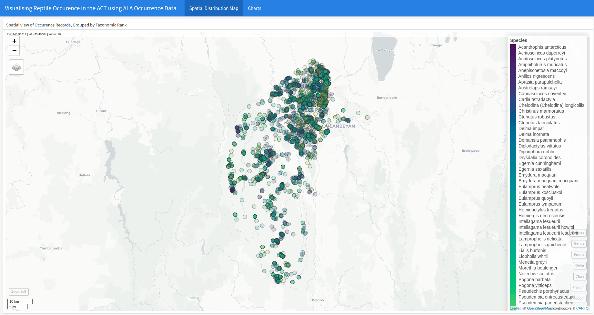
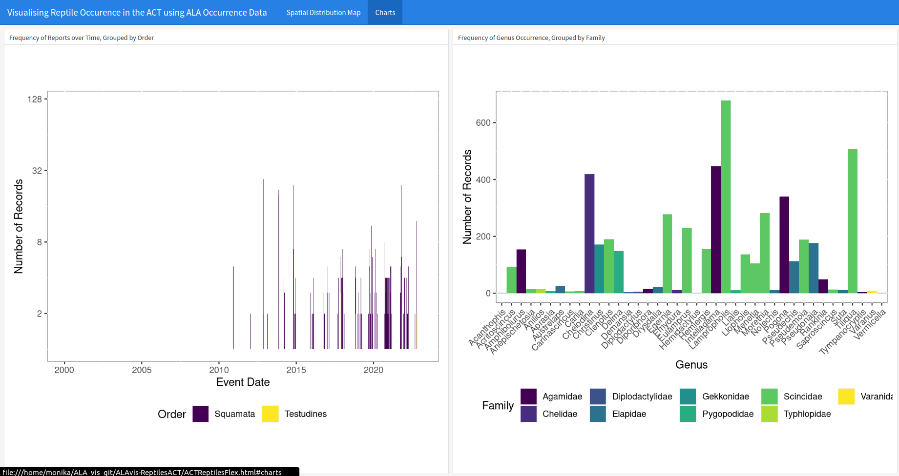

# ALAvis-ReptilesACT

A visualisation of reptiles in the ACT using ALA data. Includes a spatial distribution map with taxonomic rank layers (page 1) as well as charts displaying the occurrence distributions over time and by genus (page 2).

